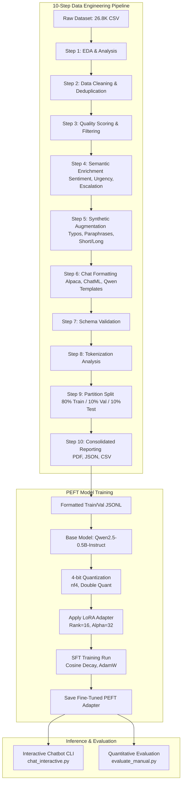

# CustomerGPT Fine-Tuning: Professional Customer Support Assistant

This repository contains the end-to-end implementation of **CustomerGPT**, a specialized customer support LLM fine-tuned on customer queries and multi-turn service dialogs. The project encompasses a comprehensive 10-step data engineering pipeline (Phase 4A) followed by Parameter-Efficient Fine-Tuning (PEFT) using QLoRA.

---

## 📌 Project Architecture & Workflow

The architecture is divided into two primary phases: the **Data Engineering & Enrichment Pipeline** and the **QLoRA Fine-Tuning Loop**.



---

## 📊 Dataset Specifications

The pipeline processes a raw dataset containing **26,872** support requests and expands it via data augmentation to enhance robustness.

### 1. Data Splits & Volume
* **Raw Records:** 26,872
* **Cleaned & Filtered Records:** 26,872 (100% pass rate at Quality Threshold $\ge 5.0$)
* **Augmented Records:** 107,488 (80,616 synthetic additions)

| Split | Percentage | Records Count | Purpose |
| :--- | :--- | :--- | :--- |
| **Train** | 80% | 85,990 | Model gradient updates |
| **Validation** | 10% | 10,748 | Early stopping & hyperparameter tuning |
| **Test** | 10% | 10,750 | Final evaluation |

### 2. Category Distribution
The dataset covers 11 primary business domains:
* **ACCOUNT:** 5,986
* **ORDER:** 3,988
* **REFUND:** 2,992
* **CONTACT:** 1,999
* **INVOICE:** 1,999
* **PAYMENT:** 1,998
* **FEEDBACK:** 1,997
* **DELIVERY:** 1,994
* **SHIPPING:** 1,970
* **SUBSCRIPTION:** 999
* **CANCEL:** 950

### 3. Feature Enrichment & Metadata
Each interaction is annotated with:
* **Sentiment:** Neutral (18,874), Negative (7,931), Positive (67)
* **Urgency:** Medium (12,376), Low (10,168), High (4,328)
* **Escalation Trigger:** True (3,485), False (23,387)
* **Complexity:** Medium (24,274), Low (2,598)

### 4. Format Structures
The data pipeline generates training files in three popular chat formats under `data/final/`:
1. **Alpaca Format:** Classic instruction-input-response formatting.
2. **ChatML Format:** Standard `<|im_start|>` and `<|im_end|>` structured dialogs.
3. **Qwen Chat Template:** Tokenizer-native format utilizing Qwen's specific special tokens.

---

## ⚙️ Model Training Specifications

The model is fine-tuned using **QLoRA (Quantized Low-Rank Adaptation)** to maximize memory efficiency while preserving modeling capabilities.

| Parameter | Configuration / Specification |
| :--- | :--- |
| **Base Model** | `Qwen/Qwen2.5-0.5B-Instruct` |
| **Training Method** | QLoRA (4-bit Quantization + LoRA) |
| **Quantization Scheme** | NormalFloat4 (`nf4`), Double Quantization, `float16` compute type |
| **LoRA Rank ($r$)** | 16 |
| **LoRA Alpha ($\alpha$)** | 32 |
| **LoRA Dropout** | 0.05 |
| **Target Modules** | All linear layers (`q_proj`, `k_proj`, `v_proj`, `o_proj`, `gate_proj`, `up_proj`, `down_proj`) |
| **Trainable Parameters** | 8,798,208 (1.75% of total 502,830,976) |
| **Max Sequence Length** | 512 tokens |
| **Optimizer** | `adamw_torch` |
| **Learning Rate (LR)** | 2e-4 with Cosine Decay (ending at 0.0) |
| **Effective Batch Size** | 8 (Batch Size 1 $\times$ 8 Gradient Accumulation Steps) |
| **Hardware** | NVIDIA GeForce RTX 4060 Laptop GPU |

---

## 📈 Fine-Tuning Metrics

The model was trained for **700 steps** (approximately 1 full pass over the dataset sequence combinations), yielding highly stable loss convergence:

* **Total Training Time:** 2,293.04 seconds (~38.2 minutes)
* **Training Speed:** 0.305 steps/second (~3.28 seconds/step)
* **Initial Loss:** 2.4139
* **Midway Loss (Step 140):** 0.8520
* **Final Training Loss:** 0.6336
* **Average Training Loss:** 0.8391

```
Loss
 3.0 | *
     |
 2.0 |   *
     |
 1.0 |     *  *  *
     |             *  *  *  *
 0.0 |________________________*
     0       200     400     700   Steps
```

---

## 🚀 Running the Project

### 1. Installation & Environment Setup
Ensure you are using Python 3.11:
```bash
# Create and activate virtual environment
python -m venv venv
.\venv\Scripts\activate

# Install PyTorch with CUDA 12.1 compatibility
pip install torch torchvision torchaudio --index-url https://download.pytorch.org/whl/cu121

# Install Deep Learning dependencies
pip install transformers==4.47.1 trl==0.12.1 peft accelerate bitsandbytes datasets tqdm
```

### 2. Run Data Engineering Pipeline
Processes the raw CSV, performs cleaning, augmentation, tokenization checks, and generates split sets:
```bash
python run_pipeline.py --raw_path Bitext_Sample_Customer_Support_Training_Dataset_27K_responses-v11.csv --quality_threshold 5.0
```

### 3. Start Model Training
Fine-tune the model using the PEFT training script:
```bash
# Start full 1-epoch training run
python train_manual.py --model_name Qwen/Qwen2.5-0.5B-Instruct --epochs 1 --output_dir outputs_manual
```

### 4. Interact with the Chatbot
Launch the terminal CLI to converse with the fine-tuned model:
```bash
python chat_interactive.py
```

### 5. Evaluate the Model
Generate output samples to compare the fine-tuned model against raw instruct base completions:
```bash
python evaluate_manual.py --base_model Qwen/Qwen2.5-0.5B-Instruct --adapter_path outputs_manual/manual_lora_adapter --samples 3
```

---

## 📂 Project Directory Structure

```
├── Bitext_Sample_Customer_Support_Training_Dataset_27K_responses-v11.csv  # Raw dataset
├── chat_interactive.py    # Terminal interface to talk to CustomerGPT
├── evaluate_manual.py     # Evaluation script for generated outputs
├── evaluate_unsloth.py    # Unsloth-based evaluation script (alternative)
├── train_manual.py        # Hugging Face standard trainer (QLoRA)
├── train_unsloth.py       # Unsloth optimized trainer (alternative)
├── run_pipeline.py        # Pipeline orchestrator (Phase 4A)
├── requirements.txt       # Core dependencies
├── metrics.txt            # Training parameters & metrics logs
├── imp.txt                # Quick execution guide
└── src/                   # Data Pipeline Source Modules
    ├── chat_formatting.py # Formats datasets (ChatML, Alpaca, Qwen)
    ├── data_cleaning.py   # Cleans whitespaces, emojis, duplicates
    ├── data_enrichment.py # Tags sentiment, urgency, complexity, escalation
    ├── data_augmentation.py # Augments text with typos and style variants
    ├── eda_analysis.py    # Computes descriptive analytics
    ├── dataset_split.py   # Split partitions (Train/Val/Test)
    ├── tokenization_analysis.py # Evaluates token length distributions
    └── generate_reports.py # Compiles PDF, JSON & CSV logs
```
